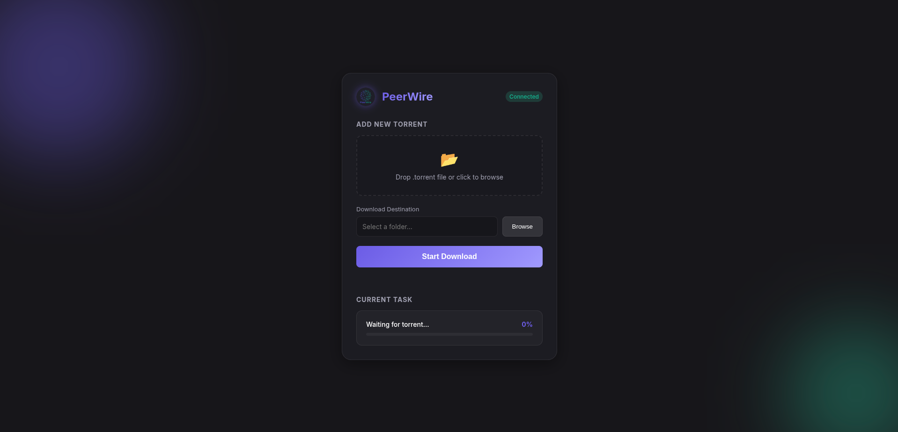

# PeerWire

<p align="center">
  
</p>

**PeerWire** is a robust, educational BitTorrent client written entirely in **Go** using only the **standard library**. It features a high-performance concurrent download engine, a modern dark-themed web GUI, and a comprehensive CLI.

## 🚀 Features

-   **Zero Dependencies**: Built with 100% Go Standard Library (`net`, `io`, `crypto/sha1`, `html/template`, etc.).
-   **Concurrent Engine**: Uses a worker pool pattern with pipelined requests for maxing out bandwidth.
-   **Protocol Support**:
    -   Bencode encoding/decoding.
    -   TCP Peer Wire Protocol (Handshake, Choke, Interested, Have, Bitfield, Request, Piece, Cancel).
    -   HTTP & UDP Tracker Protocols (with multi-tracker scaling and auto-retry).
-   **Modern GUI**: A sleek, dark-themed local web interface with glassmorphism design and real-time progress updates.
-   **Resilience**:
    -   **Peer Supervisor**: Automatically detects stalled peers and reconnects.
    -   **Multi-Tracker**: Attempts to connect to all trackers in the torrent's `announce-list`.

## 📦 Installation

PeerWire requires Go 1.25+ (or any modern Go version).

### Clone and Build

```bash
git clone https://github.com/Minesto23/peerwire.git
cd peerwire

# Build CLI
go build -o peerwire cmd/peerwire/main.go

# Build GUI
go build -o peerwire-gui cmd/peerwire-gui/main.go
```

## 🎮 Usage

### Graphical Interface (GUI)

The easiest way to use PeerWire is via the web interface.

1.  Run the GUI binary:
    ```bash
    ./peerwire-gui
    ```
2.  Open your browser to [http://localhost:8080](http://localhost:8080).
3.  Drag and drop a `.torrent` file to start downloading.

### Command Line Interface (CLI)

For headless environments or scripting:

```bash
./peerwire download <path-to-torrent> [output-path]
```

**Example:**
```bash
./peerwire download ubuntu-22.04.torrent
```

## 🏗 Architecture

The project is structured following clean architecture principles:

-   `internal/bencode`: Low-level serialization library.
-   `internal/torrent`: Metainfo (.torrent) parsing.
-   `internal/tracker`: HTTP/UDP client for peer discovery.
-   `internal/peer`: TCP Wire protocol handling.
-   `internal/engine`: Core logic (Concurrency, Pipelining, Supervisor).
-   `internal/storage`: Disk I/O management.
-   `cmd/`: Entry points for CLI and GUI.

## 🤝 Contributing

Contributions are welcome! This project focuses on educational clarity and standard library usage.

## 📄 License

MIT License.
