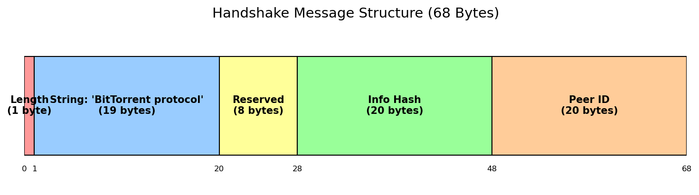
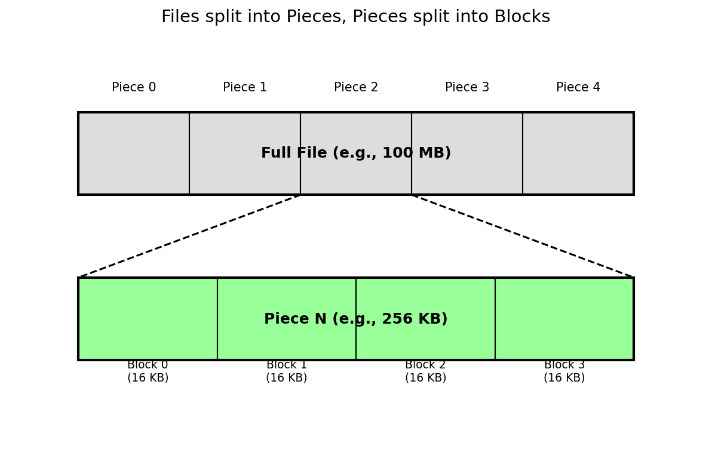
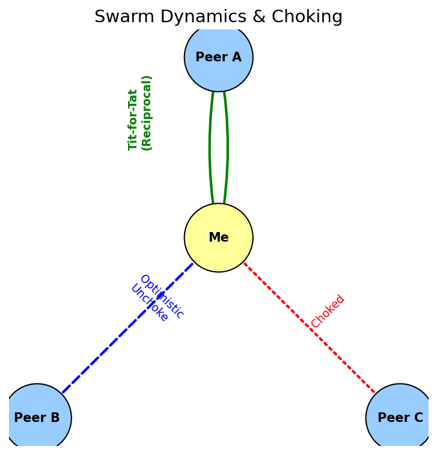
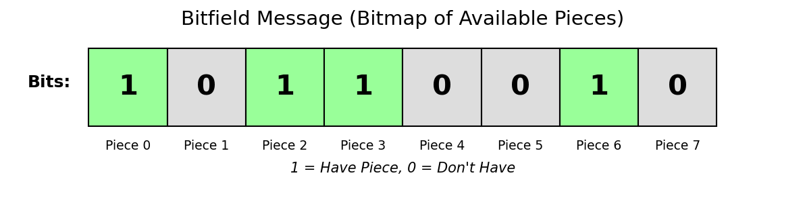

# peerwire — BitTorrent Protocol Explained (In Depth)

> This document is a **complete, from-the-ground-up explanation of the BitTorrent protocol**, written to be understood **before** implementing it in code.
>
> It serves as the technical foundation for the **peerwire** project: a BitTorrent client written from scratch in Go, using only the standard library.

---

## 0. How to Read This Document

This is **not** a quick overview.

This document is written like:

* an internal engineering design doc
* a protocol deep dive
* a mental model builder

If you understand everything here, implementing BitTorrent becomes a matter of **translation into code**, not guessing.

You do **not** need prior BitTorrent experience, but basic networking knowledge (TCP, HTTP, hashing) is assumed.

---

## 1. What Is BitTorrent?

BitTorrent is a **distributed file transfer protocol**.

Instead of downloading a file from a single server:

* the file is split into many **pieces**
* many users (**peers**) exchange pieces with each other
* each peer can upload and download simultaneously

There is **no central server** that owns the full file.

### Key Properties

* **Decentralized**: no single point of failure
* **Scalable**: more users → more bandwidth
* **Fault-tolerant**: peers can disappear
* **Integrity-safe**: every piece is cryptographically verified

BitTorrent is essentially:

> A controlled swarm of peers cooperating through strict rules.

### Image


---

## 2. High-Level Architecture

BitTorrent is composed of **several independent protocols** working together:

1. Metadata distribution (`.torrent`)
2. Peer discovery (tracker, DHT)
3. Peer communication (Peer Wire Protocol)
4. Data integrity (hash verification)
5. File reconstruction

Each part can be implemented independently.

### Image


---

## 3. The `.torrent` File (Metadata, Not Data)

A `.torrent` file does **not** contain the file you want to download.

It contains **instructions** describing:

* what the file looks like
* how it is split
* how to verify it
* where to find peers

### Core Fields

* `announce`: tracker URL
* `info`: dictionary describing the content

The `info` dictionary is the **cryptographic identity** of the torrent.

### Conceptual Structure

```
{
  announce: "http://tracker.example.com/announce",
  info: {
    name: "file.iso",
    piece length: 262144,
    pieces: <SHA-1 hashes concatenated>,
    length: 123456789
  }
}
```

### Why This Matters

Every peer must agree **exactly** on this structure.

One byte difference → different torrent.

### Image


---

## 4. Bencode — The Encoding Language of BitTorrent

BitTorrent uses **Bencode**, a minimal binary encoding format.

### Why Bencode?

* Deterministic (same input → same bytes)
* Simple to parse
* Language agnostic
* Ideal for hashing

### Supported Types

| Type       | Encoding       | Example                    |
| ---------- | -------------- | -------------------------- |
| Integer    | `i<number>e`   | `i42e`                     |
| String     | `<len>:<data>` | `4:spam`                   |
| List       | `l...e`        | `l4:spam4:eggse`           |
| Dictionary | `d...e`        | `d3:cow3:moo4:spam4:eggse` |

### Critical Rules

* Dictionary keys are **sorted lexicographically**
* No floats
* No booleans
* No null

These constraints guarantee that hashing works.

### Image


---

## 5. The Info Hash — Torrent Identity

The **info_hash** uniquely identifies a torrent.

### Definition

```
info_hash = SHA1( bencode(info_dictionary) )
```

### Why It Is Critical

* Trackers index torrents by `info_hash`
* Peers reject connections if hashes differ
* All peers in a swarm share the same hash

⚠️ Even different whitespace or key order breaks compatibility.

### Image


---

## 6. Trackers — Peer Discovery

A tracker is **not a file server**.

It only answers one question:

> Who else is downloading this torrent right now?

### Tracker Responsibilities

* Receive `info_hash`
* Return a list of peers (IP + port)

### Communication

* HTTP GET or UDP
* Response encoded in Bencode

### Image


---

## 7. Peers

A **peer** is any BitTorrent client participating in the swarm.

A peer can:

* upload
* download
* both (most common)

Peers communicate **directly with each other** over TCP.

There is no hierarchy.

---

## 8. Peer Wire Protocol (PWP)

This is the **core protocol** implemented by peerwire.

It defines:

* how peers identify themselves
* how they negotiate interest
* how data is requested and transferred

---

### 8.1 Handshake

The handshake is the **first message** between two peers.

If it fails, the connection is closed.

#### Format (68 bytes)

```
<length=19>
<"BitTorrent protocol">
<8 reserved bytes>
<20-byte info_hash>
<20-byte peer_id>
```

If `info_hash` does not match → reject.

### Image



---

### 8.2 Messages

After handshake, peers exchange messages.

#### General Format

```
<4-byte length prefix><1-byte message ID><payload>
```

#### Common Messages

| ID | Name           |
| -- | -------------- |
| 0  | choke          |
| 1  | unchoke        |
| 2  | interested     |
| 3  | not interested |
| 4  | have           |
| 5  | bitfield       |
| 6  | request        |
| 7  | piece          |
| 8  | cancel         |

These messages control **flow and fairness**.

---

## 9. Pieces and Blocks

The file is divided into **pieces**.

* Typical piece size: 256 KB
* Each piece has a SHA-1 hash

Pieces are further divided into **blocks** (usually 16 KB).

Blocks are the actual transfer unit.

### Why Blocks?

* Parallel requests
* Efficient retransmission
* Better bandwidth utilization

### Image



---

## 10. Data Integrity

When a full piece is downloaded:

1. Compute SHA-1
2. Compare with expected hash
3. Accept or discard

This guarantees:

* corruption detection
* malicious peer protection

---

## 11. File Assembly

Once all pieces are verified:

* Pieces are written at correct offsets
* File is reconstructed exactly

There is no final verification step beyond hashes.

---

## 12. Concurrency Model

A real client:

* connects to many peers
* downloads many pieces in parallel

Go is ideal because:

* goroutines map well to peers
* channels model coordination

---

## 13. Philosophy of peerwire

peerwire is:

* educational, but rigorous
* minimal, but correct
* explicit over clever

We implement the protocol **as specified**, then optimize.

---

## 14. Swarm Dynamics and Incentives

BitTorrent is not just a data transfer protocol; it is also a **game-theoretic system**.

Peers are independent, selfish actors. The protocol must encourage cooperation and discourage freeloading.

### Tit-for-Tat Strategy

Most clients implement a strategy inspired by tit-for-tat:

* Upload to peers who upload to you
* Choke peers who do not contribute

This creates:

* Fairness
* Better overall throughput
* Resistance to leeching

Although peerwire will start minimal, understanding this explains why choke/unchoke exists at all.

### Image



---

## 15. Choking and Unchoking (Flow Control)

### What Is Choking?

Choking is a peer saying:

> "I will not upload data to you right now."

Unchoking means:

> "You may request data from me."

This mechanism:

* Limits upload bandwidth
* Enforces fairness
* Prevents overload

### Optimistic Unchoking

Clients periodically unchoke a random peer to:

* Discover better peers
* Allow new peers to join the swarm

This prevents stagnation.

---

## 16. Bitfield and Piece Availability

When a peer connects, it sends a **bitfield** message.

A bitfield is:

* A bitmap
* Each bit represents whether a peer has a piece

Example:

```
10110010
```

This allows peers to:

* Know what pieces are available
* Decide interest efficiently

### Image



---

## 17. Piece Selection Strategy

Choosing which piece to download is critical.

### Common Strategies

#### Rarest First

* Download pieces with the fewest copies
* Improves swarm health

#### Random First

* Used at startup
* Quickly obtains pieces to share

#### Endgame Mode

* Request same block from multiple peers
* Reduces completion time

peerwire will initially implement a simple strategy, but this section explains why more advanced ones exist.

---

## 18. Network Errors and Resilience

In real networks:

* Peers disconnect
* Data is corrupted
* Requests time out

A BitTorrent client must:

* Retry blocks
* Blacklist bad peers
* Handle partial downloads gracefully

This is why blocks (not full pieces) are requested.

---

## 19. Why SHA-1 Is Still Used

Although SHA-1 is cryptographically weak, BitTorrent still uses it because:

* It is fast
* Collisions are extremely unlikely in this context
* Changing it would break compatibility

The hash is used for **integrity**, not authentication.

---

## 20. Single-File vs Multi-File Torrents

### Single-File Torrent

* One file
* Simple offset calculations

### Multi-File Torrent

* Directory tree
* Pieces span multiple files

The protocol treats both the same at the piece level.

peerwire will initially support single-file torrents to reduce complexity.

---

## 21. Magnet Links (Future Work)

A magnet link contains:

* `info_hash`
* No `.torrent` file

Metadata is fetched from peers using:

* DHT
* Metadata exchange

This is intentionally out of scope for the first version of peerwire.

---

## 22. Distributed Hash Table (DHT)

DHT removes the need for trackers.

Peers store:

* mappings of info_hash → peers

Implementing DHT requires:

* UDP
* Kademlia-like routing

Advanced topic, future extension.

---

## 23. Security Considerations

BitTorrent is resilient but not secure by default.

Threats:

* Malicious peers sending bad data
* Tracker poisoning
* Traffic analysis

Mitigations:

* Hash verification
* Timeouts
* Peer banning

Encryption is optional and not required for correctness.

---

## 24. Mapping Concepts to Code (Mental Bridge)

| Concept          | peerwire Package   |
| ---------------- | ------------------ |
| Bencode          | `internal/bencode` |
| Torrent metadata | `internal/torrent` |
| Tracker          | `internal/tracker` |
| Peer connection  | `internal/peer`    |
| Pieces           | `internal/piece`   |
| File I/O         | `internal/storage` |

This table is your translation layer from theory to implementation.

---

## 25. Final Mental Model

BitTorrent is:

1. Metadata → defines truth
2. Hashes → enforce truth
3. Peers → exchange truth
4. Rules → keep cooperation

If you understand this, you can implement BitTorrent in any language.

---
