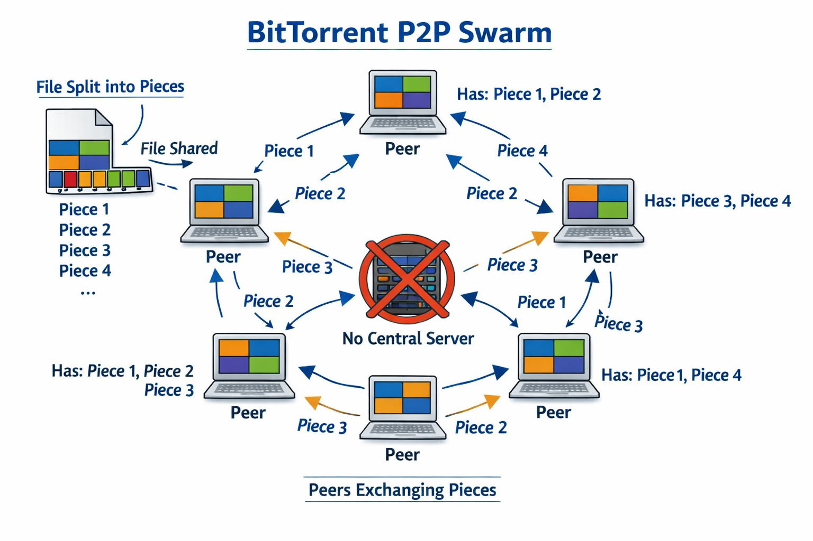
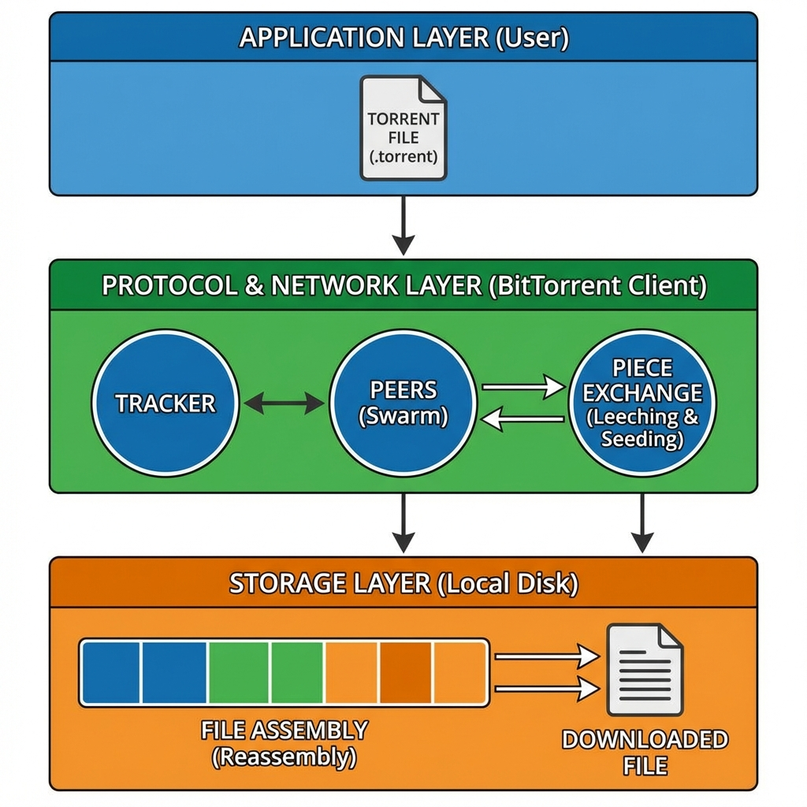
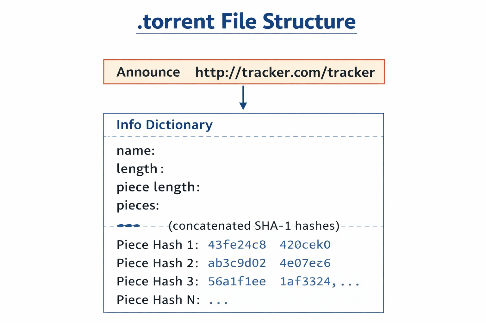
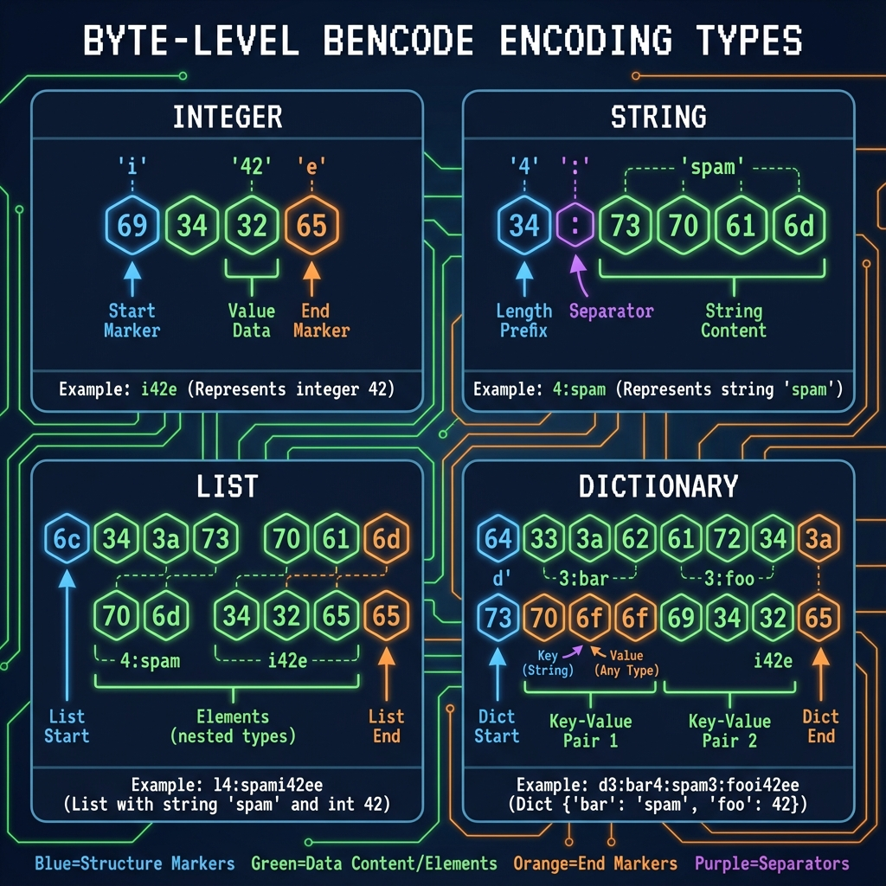
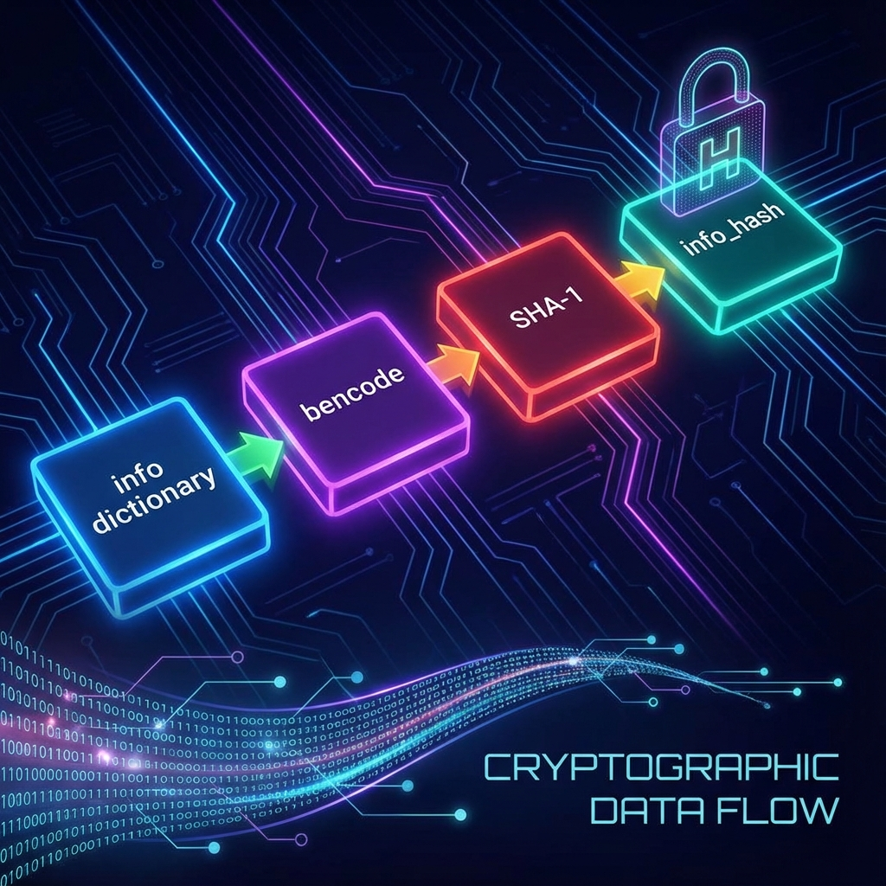

# BitTorrent Protocol Explained

This document is a complete, from-the-ground-up explanation of the BitTorrent protocol, written to be understood before implementing it in code.

It serves as the technical foundation for the peerwire project: a BitTorrent client written from scratch in Go, using only the standard library.

## 0. How to Read This Document

This is not a quick overview.

This document is written like:

- an internal engineering design doc

- a protocol deep dive

- a mental model builder

If you understand everything here, implementing BitTorrent becomes a matter of translation into code, not guessing.

You do not need prior BitTorrent experience, but basic networking knowledge (TCP, HTTP, hashing) is assumed.

## 1. What Is BitTorrent?

BitTorrent is a **distributed file transfer protocol**.

Instead of downloading a file from a single server:

- the file is split into many pieces

- many users (peers) exchange pieces with each other

- each peer can upload and download simultaneously

There is **no central server** that owns the full file.

### Key Properties

- **Decentralized**: no single point of failure

- **Scalable**: more users → more bandwidth

- **Fault-tolerant**: peers can disappear

- **Integrity-safe**: every piece is cryptographically verified

BitTorrent is essentially:

> "A controlled swarm of peers cooperating through strict rules."



## 2. High-Level Architecture

BitTorrent is composed of several independent protocols working together:

1. Metadata distribution (.torrent)

2. Peer discovery (tracker, DHT)

3. Peer communication (Peer Wire Protocol)

4. Data integrity (hash verification)

5. File reconstruction

Each part can be implemented independently.



## 3. The .torrent File (Metadata, Not Data)

A **.torrent file** does not contain the file you want to download.

It contains instructions describing:

- what the file looks like

- how it is split

- how to verify it

- where to find peers

### Core Fields

- **Announce:** tracker URL
- **info:** dictionary describing the content

The info dictionary is the ***cryptographic identity*** of the torrent.

### Conceptual Structure

```json
{
    announce: "http://tracker.example.com/announce",
    info: {
        name: "file.iso",
        piece length: 262144,
        pieces: <SHA-1 hashes concatenated>,
        length: 123456789
    }
}
```

#### Why This Matters

Every peer must agree exactly on this structure.

One byte difference → different torrent.




## 4. Bencode — The Encoding Language of BitTorrentc

BitTorrent uses **Bencode**, a minimal binary encoding format.

### **Why Bencode?**

- Deterministic (same input → same bytes)

- Simple to parse

- Language agnostic

- Ideal for hashing

### **Supported Types**

| Type	| Encoding	| Example|
| ----------- | ----------- | ----------- |
| Integer	| i<number>e	| i42e |
| String	| <len>:<data>	| 4:spam |
| List	| l...e	| l4:spam4:eggse |
| Dictionary	| d...e	| d3:cow3:moo4:spam4:eggse |

### **Critical Rules**

- Dictionary keys are sorted lexicographically

- No floats

- No booleans

- No null

These constraints guarantee that hashing works.



## 5. The Info Hash — Torrent Identity

The info_hash uniquely identifies a torrent.

### **Definition**
> info_hash = SHA1( bencode(info_dictionary) )

### **Why It Is Critical**

- Trackers index torrents by info_hash

- Peers reject connections if hashes differ

- All peers in a swarm share the same hash

⚠️ Even different whitespace or key order breaks compatibility.

